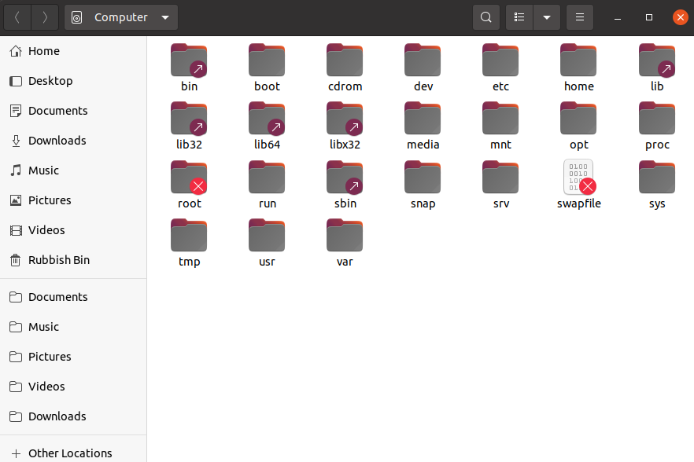
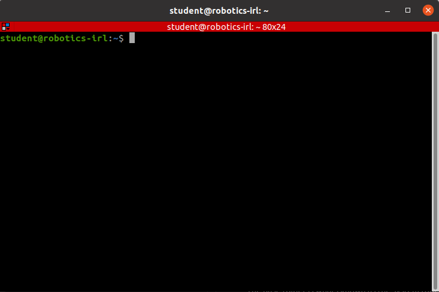

# Into to Linux for Robotics

Don't be scared!

## Starting with VM
TODO

## File and Folder layout on a Unix system

Lets examine the standard unix folder structure, from the top down. This structure is defined as a [standard](https://refspecs.linuxfoundation.org/FHS_3.0/fhs/index.html) for Linux and unix-based operating systems.

Navigate to the top directory visually via clicking on the "Files" icon in the *favourites* toolbar on the left of the screen. Open *+ Other Locations* followed by *Computer*.


The base folder is whats known as the system root directory. We'll now define the properties and contents of some of the subfolders in this directory.

| Name  | Properties                                                                         | Example                                                          |
| ----- | ---------------------------------------------------------------------------------- | ---------------------------------------------------------------- |
| /boot | Files needed to boot the system                                                    | linux kernel                                                     |
| /dev  | Device files (in unix systems everything is a file)                                | sda - first drive detected                                       |
| /etc  | System configuration files                                                         | hosts - IP's and addresses for local host etc                    |
| /home | User specific files and folders, one for each user                                 | *student's* (your) files and data such as code and study notes   |
| /opt  | Subfolders for optional packages, that dont have structure defined by the FHS      | All ROS-related shared libraries and executables                 |
| /proc | Files representing system and process info                                         | cpuinfo                                                          |
| /root | Personal files and folders for the root user, the super user / sysadmin            | similar to above                                                 |
| /usr  | Applications and libraries installed by any user. These are shared across by users | /usr/bin contains executables for basic OS use and bash commands |

## Terminal and the shell

Up till now we've navigated the system root directory visually via the file explorer. We'll now motivate the use of the command line for faster navigation, file creation and more.

Lets first open the terminal using the ```Ctrl+Alt+T```, you should see the following window pop up:



The terminal is a graphical window that lets you interact with the *Shell*.

The Shell is a textual (command line) interface to an operating systems applications and eventually the applications you will write. Every OS ships with a default shell; Powershell in Windows and the Bourne Again Shell (bash) on Linux/Mac platforms, which are similar in principal but have available to them different default commands for navigation and manipulation.

Lets examine the text printed on the terminal: 
```student@robotics-irl:~$```
This is known as the *prompt*. This prompt tells you that you are user *student* on machine *robotics-irl*. Both of these were defined when we set up the VM. The *~* is shorthand for *home*, meaning you are currently in the home or base directory of user *student*. Finally, the *$* shows that you currently don't have root privelages, meaning commands that you run now will not be run as the superuser.

## Navigating and Examining Folders
Lets start running through a few commands

```bash
student@robotics-irl:~$ ls # Show the contents of the current working directory
student@robotics-irl:~$ ls -a # Above plus hidden folders or files (prefixed by .)
```

Feel free to confirm the terminal output with that of the File explorer (it default opens to the user's home directory)

After running ```ls -a``` you will notice two peculiar entries, that of *.* and *..*
With most (all?) Operating Systems, there exists the concept of absolute and relative paths. An absolute path to a file on your system is a */* separated list of the folders between said file and the *root* directory. Absolute paths are prefixed with */*. A relative path to a file is the path relative to where you currently are now. The directory above where we are now is refered to as *..*, our current directory is *.*

Lets put confirm this with some exercises. Knowing that we are in the home directory of the user *student* what do you think the absolute path of our current working directory is? Run the following to confirm this:

```bash
student@robotics-irl:~$ pwd # prints the absolute path of the current/present working directory
```
As you can see, we're in */home/student*, otherwise known as the *home* directory of user *student*. The above is an absolute path, so we can expect the folder *home* to be in the root directory, which we saw at the start of the tutorial.

In the terminal, we can jump to other directories via the *cd* (change directory) command. Confirm everything we mentioned above running the commands in the following script.

```bash
student@robotics-irl:~$ pwd
/home/student
student@robotics-irl:~$ cd .. # change into parent directory
student@robotics-irl:/home$ pwd
/home
student@robotics-irl:/home$ ls
student
student@robotics-irl:/home$ cd .. # change into parent directory
student@robotics-irl:/$ pwd # the root directory, aslo known as /
/
student@robotics-irl:/$ cd /home/student/ # change to your users home directory
student@robotics-irl:~$ cd / # go back to root directory
student@robotics-irl:/$ ls # show contents of root directory
bin   cdrom  etc   lib    lib64   lost+found  mnt  proc  run   snap  sys  usr
boot  dev    home  lib32  libx32  media       opt  root  sbin  srv   tmp  var
student@robotics-irl:/$ cd ~ # same as "cd /home/student"
student@robotics-irl:~$ pwd
/home/student
```

Congratulations, you're now a hacker!

## Creating files and folders

```todo
mkdir, touch, cat
create a bash file, run it
how the shell interprets a file
shebang
ls -l
```

Now that we can navigate around the Ubuntu filesystem, lets start adding our own files to it.

```bash
student@robotics-irl:~$ cd ~ # make sure we are starting from the home directory
student@robotics-irl:~$ mkdir test_folder # create a folder called test_folder in the home directory (ie in the directory we are now in)
student@robotics-irl:~$ cd test_folder
student@robotics-irl:~/test_folder$ touch print_path # create a file called print_path in test_folder
student@robotics-irl:~/test_folder$ ls
print_path
student@robotics-irl:~/test_folder$ cat print_path # print the contents of this file (its empty for now) 
```

We first ensure that we are starting from the home directory. Remember, all paths are relative unless prefixed with a */*. We then create a folder in this directory via the *mkdir* command. If we wanted to create this folder in the same location but from an alternative working directory, we could instead have given the full absolute path: ```mkdir /home/student/test_folder```. Within this folder we create a new and empty file via the *touch* command. The primary funtion of *touch* is to update the "accessed" timestamp of the a file, but it the file name given does not already exist it will create a new and empty one. We can confirm this by running *cat* on the file which prints a files contents to the terminal.


## Manipulating files and their paths 
mv, rm (rm -f), cp

## Install an executable
install an executable
$PATH, find a file

shell is just an ide


